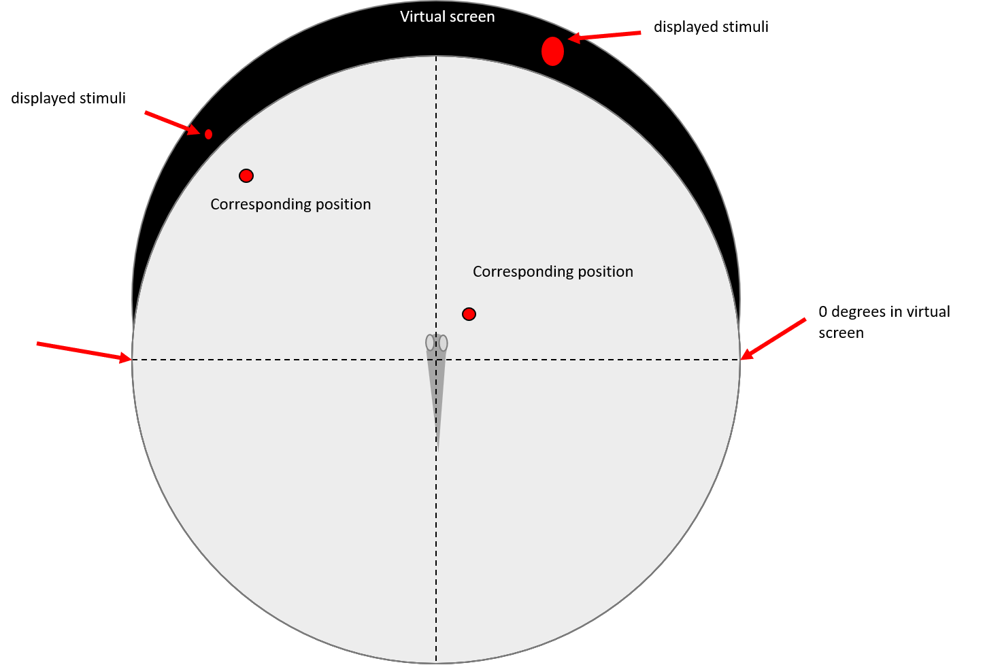
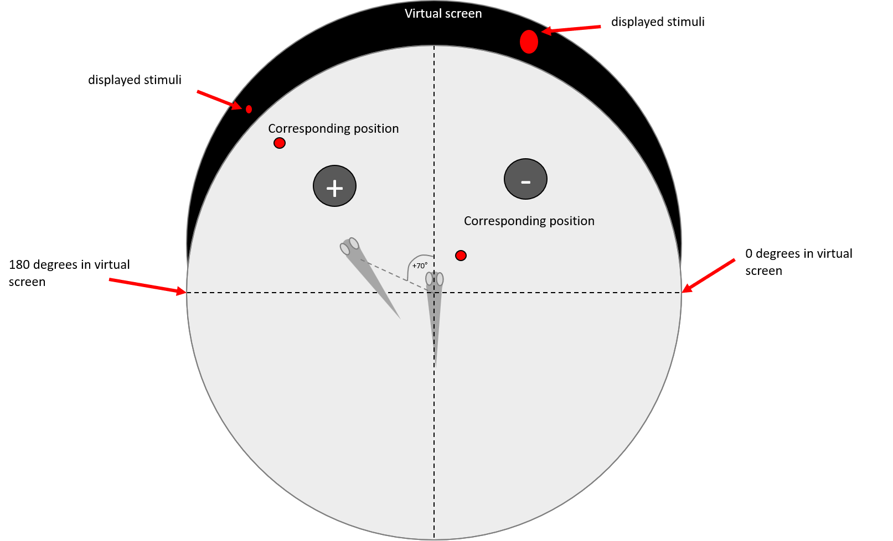
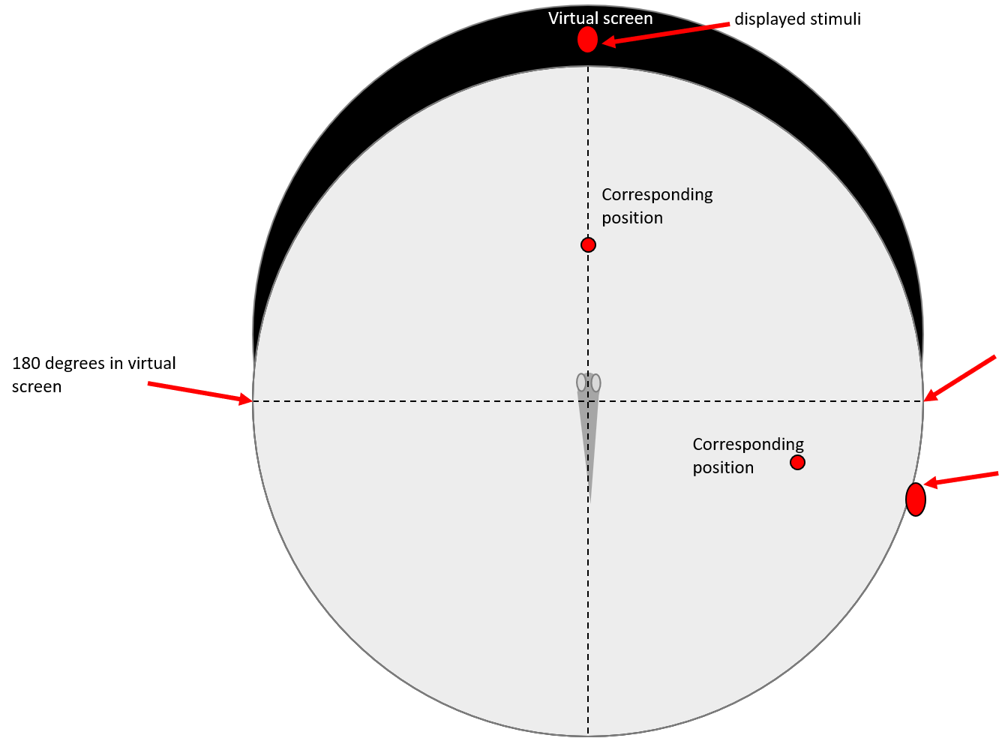

# Stimulus Generator Guide

## Controls

### Supported Keyboard Actions
| Key     | Action                                                 |
|---------|--------------------------------------------------------|
| **`?`** | Show help                                              |
| **`l`** | Switch to virtual screen location setting              |
| **`s`** | Switch to virtual screen size setting                  |
| **`↑`** | Move up / reduce virtual screen height                 |
| **`↓`** | Move down / increase virtual screen height             |
| **`←`** | Move left / reduce virtual screen width                |
| **`→`** | Move right / increase virtual screen width             |
| **`u`** | Update app config with current virtual screen location |
| **`r`** | Run simulation                                         |
| **`p`** | Pause simulation                                       |
| **`o`** | Exit program                                           |

---

## Configuration Files
all config files are under config_files directory
### `appConfig.csv`
Key parameters and settings:
- **`fishScreenStartX` / `fishScreenStartY`**: Defines the starting point of the fish screen.
- **`fishScreenWidth` / `fishScreenHeight`**: Defines the dimensions of the fish screen.
- **`DishRadiusSize`**: Radius of the fish-dish (in mm), used for calculations (e.g., degrees, size, speed).
- **`VirtualScreenDegrees`**: Proportion of the 360° virtual screen covered. Speed measured in degrees/second.
- **`VirtualScreenWidthActualSize`**: Real-world width of the virtual screen (in mm).
- **Colors**: 
  - `backgroundColor`: white / black
  - `virtualScreenColor` white / black
  - `stimulusColor` white / black
- **`NiDaqPulseEnabled`**: 
  - `ON`: Sends events to microscope computers at the start of each stimulus.
  - `OFF`: Disables event sending.
- **`projectorOnMonitor`**: Monitor number for stimulus projection.
- **`cameraControl`**: 
  - `ON`: Activates and captures video.
  - `OFF`: Disables camera.
- **`data_path`**: Directory for saving files (use double `\\` for paths, e.g., `C:\\Data`).
- **`split_files`**: Frequency (in seconds) for splitting files to prevent crashes.
- **`image_file_type`**: Supported types (e.g., PNG, JPEG).

### `stimulusConfig.csv - for open loop stimuli`
- **Coordinates**: Virtual screen coordinates range from (0,0) to (999,999).
- **Formula**: Converts virtual screen coordinates to real-world dimensions:
  - `x = trunc(x / virtual screen width)`
  - `y = trunc(y / virtual screen height)`

#### Example Parameters
| Parameter            | Description                                                                                      |
|----------------------|--------------------------------------------------------------------------------------------------|
| **`startX, startY`** | Start coordinates (top-left corner aligns with fish screen).                                     |
| **`endX, endY`**     | End coordinates of the shape track.                                                             |
| **`repetition`**     | Number of repetitions.                                                                          |
| **`startShapeRadius, endShapeRadius`** | Shape size in degrees.                                                       |
| **`fastDuration, slowDuration`** | Time (in ms) for each phase.                                                        |
| **`startMode`**      | Start AFTER or WITH the previous stimulus (delays can be applied).                              |
| **`fastSpeed, slowSpeed`** | Speed in degrees per second.                                                              |
| **`exitCriteria`**   | Conditions for ending the stimulus (e.g., Distance or Time).                                    |
| **`xType`**          | `degrees` or `pixel` for interpreting position parameters.                                      |

#### Formulas
- **Object Size (mm)**: `2 * DishRadiusSize * tan(shapeRadius / 2)`
- **Object Size (pixels)**: `(vsWidth[pixels] * objectSize[mm]) / VirtualScreenWidthActualSize[mm]`


### `stimulusConfig.csv - for closed loop stimuli`

#### Example Parameters
| Parameter                                 | Description                                                                                                                                                                                                                                                                                                                                                                                                                                                                                                    |
|-------------------------------------------|----------------------------------------------------------------------------------------------------------------------------------------------------------------------------------------------------------------------------------------------------------------------------------------------------------------------------------------------------------------------------------------------------------------------------------------------------------------------------------------------------------------|
| **`Type`**                                | Either static / dynamic. This defines the stimuli's behaviour of when to disappear and what happens to it after a fish movement. If static then it can return to the fish's field of view even after leaving it, and after movements it is simply displayed in it's new position. If dynamic then it only stays as long as it is in the field of view and after the fish movement it continues to move at the original speed times cut_velocity_by_factor in the same direction toward the edge on the screen  |
| **`startX, endX`**                        | Start and end angle (0-180)                                                                                                                                                                                                                                                                                                                                                                                                                                                                                    |
| **`startY, endY`**                        | Start and end Y coordinates (top-left corner aligns with fish screen).                                                                                                                                                                                                                                                                                                                                                                                                                                         |
| **`repetition`**                          | Number of repetitions.                                                                                                                                                                                                                                                                                                                                                                                                                                                                                         |
| **`startShapeRadius, endShapeRadius`**    | Shape size in degrees.                                                                                                                                                                                                                                                                                                                                                                                                                                                                                         |
| **`delay`**                               | delay in ms for stimuli onset in reference to the start of this batch                                                                                                                                                                                                                                                                                                                                                                                                                                          |
| **`duration`**                            | time in ms for the stimulus to complete it's repetition - influences the stimulus moving speed                                                                                                                                                                                                                                                                                                                                                                                                                 |
| **`useSpacer`**                           | Either TRUE/ FALSE - if true, at the end of each repetition the stimuli will disappear for spacerDuration before starting the next repetition                                                                                                                                                                                                                                                                                                                                                                  |
| **`spacerDuration`**                      | time in ms of the spacer duration, only relevant if useSpacer is set to true, if not relevant put any number                                                                                                                                                                                                                                                                                                                                                                                                   |
| **`batchNum`**                            | the batch index - all stimuli with the same batch number will be grouped together and executed as the same scenario. between batches we present a spacer before starting the next batch                                                                                                                                                                                                                                                                                                                        |
| **`useAfterFirstMovement`**               | Either TRUE or FALSE - if FALSE this stimuli will not be presented if the first movement already occured before it's onset. The first stimuli of the batch always occurs regardless of this field                                                                                                                                                                                                                                                                                                              |


#### How we update stimuli after fish movement
The stimulus's angle and size are updated dynamically after each detected fish movement, ensuring accurate positioning relative to the fish's new location.
1. **Fish Movement**  
   - The fish's new position is calculated in Cartesian coordinates based on its predicted angle and distance.

2. **Stimulus Repositioning**  
   - The stimulus’s position is recalculated relative to the fish’s new origin using vector math.

3. **New Stimulus Properties**  
   - **Angle**: The updated angle is determined based on the relative positions of the fish and stimulus, adjusted to fit within `0°` to `360°`.
   - **Size**: The new distance which is proportional to the stimulus radios is computed as the Euclidean distance between the fish and the stimulus.

This process ensures the stimulus remains responsive to the fish's behavior, providing a realistic and dynamic simulation.






### `closed_loop_config.py`
The application includes a configuration file for fine-tuning various parameters related to debugging, camera settings, and stimuli behavior. Below is an explanation of each parameter and its purpose.  

### Debugging Options  
- `debug_mode`: Set to `True` to visualize tail tracking in real-time. Default: `False`.  
- `debug_time`: Set to `True` to log timing specifications to the console. Default: `False`.  

### Emulator Settings  
- `emulator_with_camera`: Set to `True` to enable development mode with pre-recorded data and without a real fish. Requires `camera_emulator_on` to be `False`. Default: `False`.  
- `camera_emulator_on`: Set to `True` to enable development mode using pre-recorded data without a real fish or camera. Requires `emulator_with_camera` to be `False`. Default: `True`.  

### Tail Tracking  
- `number_of_tail_segments`: Resolution of tail tracking. Higher values increase precision but take longer. Default: `23`.  

### Virtual Screen Settings  
- `start_angle`: Start angle of the virtual screen for stimuli (degrees). Default: `30`.  
- `end_angle`: End angle of the virtual screen for stimuli (degrees). Default: `150`.  
  *Note: The entire screen spans 15–165 degrees.*  

### Stimuli Configuration  
- `stimuli_moving_time`: Time (in ms) for stimuli to move to their predicted location after a bout occurs. Default: `500`.  
- `calibration_stimuli_speed`: Stimuli movement speed during calibration (degrees/second). Default: `10`.  
- `number_of_frames_calibration`: Number of frames for calibration. Ensure the fish moves during this period. Default: `100`.  
- `cut_velocity_by_factor`: Factor (0–1) for reducing the velocity of dynamic stimuli after movement. Default: `1`.  

### Tracking Options  
- `use_stytra_tracking`: If `True`, use Stytra tracking (faster). If `False`, use lab tracking (slower). Default: `True`.  

### Camera Configuration  
- `camera_frame_rate`: Camera frame rate in Hz. Supported values: `166`, `250`, `500`. Default: `250`.  
- `fr_for_realtime_is_500`: Set `True` to use 500 Hz frame rate for bout prediction. Default: `False`.  
  - If `True`:  
    - `frames_from_bout`: `35`.  
  - If `False`:  
    - `frames_from_bout`: `12`.  

#### Camera Frame Dimensions  
Based on the `camera_frame_rate`, the following dimensions and offsets are applied:  

| Frame Rate (Hz) | Width (pixels) | Height (pixels) | Offset X (pixels) | Offset Y (pixels) | Take Every X Frame |  
|------------------|----------------|-----------------|-------------------|-------------------|---------------------|  
| 500              | 352            | 312             | 852               | 882               | 3                   |  
| 166              | 1408           | 884             | 340               | 500               | 1                   |  
| 250              | 416            | 400             | 820               | 780               | 2                   |  

### Timing  
- `spacer_time_between_batches`: Time (in ms) between batches of stimuli. Default: `5000`.  

---

## Action Items
### Completed
- ✅ Reload CSV functionality.
- ✅ Show/hide cross.
- ✅ Change speed dynamically.
- ✅ Support subsequent stimuli with delay ≥ 0.
- ✅ Increase size linearly.
- ✅ Add label displaying current stimulus info.

### Pending
- [ ] Add callback function that can add a predefined stimulus to display when we recognize a movement.

---

## Installation  

Follow these steps to set up the environment for running the application.  

### Step 1: Install Anaconda  
1. Download and install Anaconda:  
   - [Download Anaconda](https://www.anaconda.com/products/distribution)  
2. Follow the installation instructions for your operating system.  

### Step 2: Download and Install Spinnaker SDK  
1. Download the full Spinnaker SDK 3.2.0.62:  
   - [Download Spinnaker SDK](https://www.flir.com/products/spinnaker-sdk/)  
2. Install the SDK by following the instructions for your operating system. Ensure it is properly configured to work with Python.  

### Step 3: Set Up the Conda Environment  
1. Open the **Anaconda Prompt**.  
2. Navigate to the directory containing the `environment.yaml` file:  
   ```bash  
   cd StimulusGenerator/installation_files  
3. Create the new Conda environment using the `environment.yaml` file  
    ```bash  
    conda env create -f environment.yaml 
4. Activate the new environment 
    ```bash  
    conda activate closed_loop 
   
### Step 4: Configure PyCharm Environment  
1. Open **PyCharm**.  
2. Navigate to **File > Settings > Project > Python Interpreter**.  
3. Select the newly created `closed_loop` Conda environment.  
4. Click **Apply** to save the changes.  

### Step 5: Run the Application  
1. Ensure all dependencies are correctly installed and configured.  
2. Run the main application file using the following command:  
   ```bash  
   python SGMainApp.py 
   
---
## Alternatives and Resources
- [Stytra Examples](http://www.portugueslab.com/stytra/userguide/1_examples_gallery.html)
- [Psychtoolbox Morph Demo](http://psychtoolbox.org/docs/MorphDemo)

   

